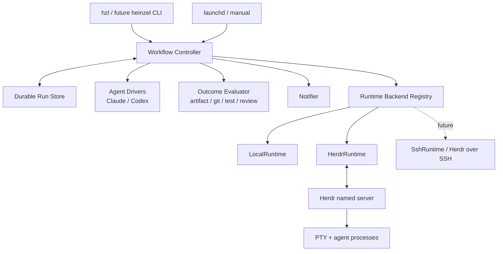

# Heinzel pluggable runtime/backend と Herdr 統合設計

> Status: **Adopted as the working plan 2026-09-01 — phased implementation is feasible; Herdr writer enablement requires Phase 0 and Phase 2 gates**  
> Written: 2026-08-31, adopted into the repository 2026-09-01  
> This document is a non-normative proposal: it plans the work. `docs/SPEC.md` stays the normative contract and code stays authoritative; when implementation and this plan diverge, update this file's phase notes rather than silently drifting.  
> The phased TODOs derived from §20 live in the operator's backlog and are worked nightly; each completed task follows `docs/RELEASING.md`.  
> Heinzel baseline: HEAD `e974c44` に未コミット変更を加えた読み取り専用 snapshot  
> Herdr baseline: v0.8.2 (`2290257acb2085ce6842ba5c7e3ca50c3ba64f02`) の公開 source と 0.8 系公式ドキュメント

## 1. 結論

この統合は十分に実現可能である。ただし **Herdr を writer backend として有効化する前に、現行 local backend 上で durable controller、run 固有 worksheet、scoped claim、workspace writer lease、verification 後 ledger commit を完成させる**ことを条件とする。Herdr 0.8 系には、必要な基本要素である persistent PTY、named session、workspace/tab/pane、Claude Code/Codex の起動、prompt、wait、read、attach、状態イベント、native session reference がある。

ただし、これは `lib/engines.sh` の `engine_run` に `if herdr` を足す変更ではない。現在の Heinzel は agent CLI を同期子プロセスとして起動し、その終了を run の区切りにしている。一方 Herdr では agent process が Heinzel の controller より長く生存する。この差を吸収するため、次の三層へ分離する。

1. **Agent Driver** — Claude/Codex 固有の引数、権限、resume、出力正規化
2. **Runtime Backend** — process/PTY、prompt、状態観測、再接続、attach
3. **Workflow Supervisor** — step 順序、timeout/retry/heartbeat、検証、最終 outcome、通知

設計の中心原則は次の一文である。

> **Herdr is the agent process supervisor; Heinzel is the agent workflow supervisor.**

Herdr の `done` / `idle` は「agent が入力待ちへ落ち着いた」という runtime observation にだけ使う。成果物、Git delta、test、review policy を Heinzel が検証し終えるまでは `SUCCESS` にしない。

実装開始前に Phase 0 の live spike を必須とする。現在の環境には Claude Code 2.1.246 と Codex CLI 0.147.0 はあるが、Herdr は未インストールであり、interactive 起動時の sandbox parity、blocked 検知、cold restart、attach は未実測である。これらが fail-closed で成立しない場合、Herdr backend を unattended の既定値にしてはならない。

## 2. 現状と変更理由

### 2.1 現在の Heinzel

現在の構成には再利用できる良い境界がある。

- `lib/engines.sh` が Claude/Codex 固有の起動引数と `result.json` 正規化を集中管理している。
- `bin/hzl-run` は agent の prose ではなく worksheet と ledger の実状態から完了数を決める。
- `bin/hzl-changeset` と `bin/hzl-review` に deterministic shell → LLM review → gate という流れがある。
- state 更新、run record、worksheet の scope 制限には atomicity と provenance の考え方が一部ある。ただし、現状で temp file + rename が徹底されているのは主に `state.json` であり、backlog/worksheet/runs record を跨ぐ transaction は新設が必要である。

一方、Herdr 統合に対しては次の前提が衝突する。

- `engine_run` が command build、process start、stdin、watchdog、output parse を一体で所有している。
- agent は PTY を持たず、stdin は `/dev/null` へ閉じられる。
- controller の終了時 cleanup が子 process group を kill し、worksheet を消し、`[~]` を戻す。
- `run.lock`、`run.pid`、`state.json` は一つの同期 run を前提とする。
- workflow は executor → optional reviewer → optional one-shot fixer として `bin/hzl-run` に固定されている。
- heartbeat、live blocked、prompt 追送、attach、汎用 retry、スマホ通知がない。
- `verdict: ok`、ledger `[x]`、runner の `ok` log が存在するが、deterministic acceptance を全て通過した最終 `SUCCESS` は独立していない。

### 2.2 Herdr が提供するものと限界

| 要求 | Herdr 0.8 系 | 設計上の扱い |
|---|---|---|
| PTY と detach/reattach | 対応 | process supervision と human attach に使う |
| named session | 対応 | Heinzel run の isolation boundary に使う |
| Claude/Codex 起動 | `agent start` | Agent Driver が作った kind/args を渡す |
| prompt 送信 | `agent prompt` | 送信は at-most-once。曖昧時は再送しない |
| working/blocked/idle/done | 対応 | scheduling hint。成功の根拠にはしない |
| output 取得 | `agent read` / `pane read` | tail snapshot と診断用。完全な成果物とはみなさない |
| wait/event | `agent wait` / `events.subscribe` | 低遅延化と状態観測に使う |
| server restart 後の会話 resume | official integration の native session reference | 起動条件を再検証して Heinzel が再開する |
| prompt turn の厳密な correlation | 非対応 | 一 agent 一 in-flight turn、durable dispatch state で補う |
| 成果物/test に基づく成功判定 | 非対応 | Heinzel の責務 |
| スマホ通知 | 非対応 | Heinzel の Notifier の責務 |

Herdr の `done` は process exit ではない。背景で `working` から入力待ちへ戻り、まだその tab が閲覧されていないときの `idle` 表示である。tab/pane/agent focus により `done` が `idle` へ変わり得るため、両者は workflow 上同じ `SETTLED` として扱う。direct `agent attach` 自体は focus/seen を変更しないので、attach と focus は同義にしない。

また `agent prompt --wait` は個々の turn を識別しない。既に `working` の agent へ送ると、先行 turn の完了が wait を満たす可能性がある。したがって Heinzel は ready 状態からだけ prompt を送り、一 agent につき unresolved turn を一つに制限する。

Claude/Codex の official integration は native session identity を報告するが、lifecycle state は主に terminal bottom buffer と screen manifest の検出である。agent/UI version による false positive/negative を排除できないため、`blocked` は早期通知の signal、`idle|done` は quiescence trigger、`unknown` は非成功として扱う。

## 3. 用語

既存の Heinzel `session` と Herdr `session` を混同しない。

| 用語 | 意味 |
|---|---|
| Heinzel work session | `hzl work` / `hzl mobile` から `off` / TTL までの unattended 時間枠と予算単位 |
| workflow run | 一つの task を完了判定まで進める durable execution |
| step | executor、reviewer、fixer、verifier など workflow の一段 |
| attempt | 一つの step の再試行単位 |
| turn | 一 agent に送る一つの prompt と、それに対応する settled/block の観測単位 |
| engine | `claude`、`codex` など agent CLI の種類 |
| backend/runtime | `local`、`herdr`、将来の `ssh` など process execution の実装 |
| Herdr namespace | Herdr の named session。本文では bare な「session」と呼ばない |
| runtime observation | `working`、`waiting_input`、`settled` 等。成功判定ではない |
| workflow outcome | `SUCCESS`、`FAILED_VERIFICATION`、`BLOCKED` 等の Heinzel 最終判断 |

## 4. 目標と非目標

### 4.1 目標

- `local` と `herdr` を同じ Runtime Backend 契約で選べる。
- 将来 `ssh` または `herdr+ssh` を追加しても workflow core を変更しない。
- Claude → Codex review → Claude fix を durable state machine として表現する。
- controller や端末が落ちても Herdr agent を再発見し、重複 prompt なしで再開する。
- timeout、retry、heartbeat、blocked、abnormal stop を一貫して扱う。
- artifact、Git delta、test、review policy を満たしたときだけ `SUCCESS` にする。
- blocked / lost / timeout / failure を deduplicate してスマホ通知へ渡す。
- 現行 local backend と既存 `result.json` / `runs.jsonl` を段階的に互換維持する。

### 4.2 非目標

- Herdr 自体へ workflow engine を実装すること。
- agent 同士に pane 経由で直接 orchestration させること。
- TUI の prose や spinner を解析して task success を推測すること。
- blocked の承認内容を Heinzel が自動選択すること。
- 初期リリースで remote filesystem sync を解決すること。
- 同一 working tree に複数の writer agent を同時実行すること。
- Herdr を暗黙に install/upgrade したり、失敗時に local へ黙って fallback すること。

## 5. 不変条件

1. **`Herdr done != Heinzel SUCCESS`**。`done|idle` は writer quiescence を始めてよいという signal にすぎない。
2. **engine と backend は直交する**。`claude@herdr` は組合せであり、新しい engine 名ではない。
3. **backend handle は opaque**。workflow core は pane ID、PID、socket path、SSH path を解釈しない。
4. **副作用より先に durable intent を保存する**。agent start、prompt、cancel、ledger commit が対象である。
5. **prompt は at-most-once**。送達不明の prompt を blind retry しない。
6. **一 agent 一 in-flight turn**。`working` 中の追加 prompt は workflow が明示的に許可しない限り禁止する。
7. **検証は成果物が存在する host/workspace revision 上で行う**。local の古い checkout を remote 成果の検証に使わない。
8. **安全設定を再開時にも再現できなければ agent を起動しない**。silent downgrade を許さない。
9. **agent は Heinzel control store を書けない**。agent-produced completion は evidence であり authority ではない。
10. **backend が unavailable でも workflow state を捏造しない**。`UNREACHABLE` と `FAILED` を分ける。
11. **human focus/attach は observation を変えても outcome を変えない**。focus による `done -> idle` は no-op である。
12. **ledger の `[x]` commit は mandatory verification 後**。候補 completion と確定 completion を分ける。
13. **一つの `workspace_identity` に writer は一つ**。namespace が別でも同じ checkout への並行 writer を許可しない。
14. **停止確認前に ownership を解放しない**。claim、worksheet、writer lease は agent/process の停止を確認するまで保持する。
15. **prompt acknowledgement は activity ではない**。post-dispatch の lifecycle change または authoritative checkpoint を確認するまで `RUNNING` にしない。
16. **cold resume は失われた turn の完了を意味しない**。open turn 中の process loss は `INTERRUPTED` とする。
17. **final verification 中に live writer を残さない**。writer の停止確認と final workspace digest 固定後にだけ検証・ledger commit する。

## 6. アーキテクチャ



### 6.1 責務表

| Component | Owns | Does not own |
|---|---|---|
| Agent Driver | executable/kind、model/effort、role permissions、sandbox args、resume args、engine output normalization | PTY、retry、workflow order、success |
| Runtime Backend | process/PTY lifecycle、prompt I/O、wait/read、interrupt、reconnect、attach、co-located command execution | task semantics、review loop、ledger、success |
| Workflow Controller | step graph、attempt、deadline、retry、heartbeat、recovery、blocked transitions | engine CLI flags、PTY internals |
| Outcome Evaluator | artifact、Git delta、test result、worksheet scope、review policy、final outcome | agent lifecycle detection |
| Notifier | transition delivery、redaction、dedupe | workflow state decision |
| Herdr | terminal server、pane/agent lifecycle、native session reference | Heinzel task completion |

### 6.2 backend と transport の長期構造

公開選択子は registry key とし、閉じた enum にしない。

```text
local       = LocalTransport + DirectProcessSupervisor
herdr       = LocalTransport + HerdrSupervisor
ssh         = SshTransport   + DirectProcessSupervisor       # future
herdr+ssh   = SshTransport   + HerdrSupervisor                # future
```

初期実装は `local` と `herdr` の二つでよいが、内部 handle に local absolute path を共通項として埋め込まない。将来の SSH は「Herdr mode の特別分岐」ではなく同じ registry に追加する。

## 7. Agent Driver 契約

現在の `lib/engines.sh` から process supervision を外し、engine knowledge だけを残す。

```text
engine_probe            <engine> <runtime-context> <report.json>
engine_build_launch     <engine> <role> <io-mode> <spec.json>
engine_build_resume     <engine> <role> <session-ref> <spec.json>
engine_render_prompt    <engine> <role> <step-spec> <prompt-file>
engine_normalize_result <engine> <collected-output> <result.json>
engine_auth_error       <engine> <native-result> -> 0/1
```

`spec.json` は executable、引数 array、環境、期待する agent kind を構造化して持つ。shell command string にしない。LocalRuntime は `executable + argv` を直接起動する。

Herdr 0.8 の `agent.start` は `kind + args` だけを受け、executable/env/cwd を直接指定できない。さらに bare `claude` / `codex` command を既存 interactive shell へ送るため、user rc の alias/function/PATH が起動前に介入し得る。事後の process attestation だけでは既に起きた副作用を取り消せない。

したがって HerdrRuntime は workspace/pane provision 時に cwd と role-specific env を設定し、**agent start 前から** Heinzel-owned clean shell wrapper（user rc を読まない、sanitized env/PATH、function/alias 無効）と、その PATH 先頭の version-pinned `claude` / `codex` wrapper を使う。Herdr 0.8 の設定でこの pre-launch invariant を構成・検証できなければ、upstream に absolute executable/command bypass を追加するまで unattended backend を unsupported とする。cold restart では env が復元されないため restored pane を実行に再利用せず、native session ref を回収して fresh role pane を controlled env で provision してから resume する。

```json
{
  "schema_version": 1,
  "engine": "codex",
  "agent_kind": "codex",
  "executable": "codex",
  "role": "reviewer",
  "argv": ["-C", "/repo", "-s", "read-only", "-a", "never"],
  "env": {},
  "io_mode": "interactive",
  "security_profile": "review-read-only-v1"
}
```

重要なのは、Herdr backend が `if engine = codex` と分岐しないことである。resume の subcommand/option 順序、Claude の `--settings` / `--permission-mode dontAsk` / deny tools、Codex の `-s read-only|workspace-write` / approval policy は Agent Driver が所有する。

## 8. Runtime Backend 契約

言語非依存の意味論は次の通りである。

```text
probe(config)                                  -> CapabilityReport
provision(run_spec)                            -> RuntimeHandle
start_agent(runtime, launch_spec, attempt_id)  -> AgentHandle
send_prompt(agent, turn_spec)                  -> DispatchReceipt
observe(agent)                                 -> RuntimeObservation
wait(agent, wait_spec)                         -> RuntimeObservation
read_output(agent, read_spec)                  -> OutputSnapshot
exec_verifier(runtime, command_spec)           -> CommandResult
quiesce(agent, quiesce_policy)                 -> RuntimeObservation
interrupt(agent, grace_policy)                 -> RuntimeObservation
reconcile(runtime, stored_handles)             -> ReconcileResult
attach(runtime, target, attach_mode)            -> AttachResult
dispose(runtime, ownership_policy)              -> DisposeResult
```

`exec_verifier` も runtime の security boundary 内で実行する。`command_spec` は shell string ではなく `argv[]`、`cwd`、`workspace_identity`、timeout、security profile、environment allowlist、network/write policy を持つ。backend が要求 profile を fail-closed に実現できない場合、unsandboxed command へ退化せず `verifier_unavailable` を返す。

### 8.1 capabilities

backend は最低限、次の capability を報告する。

```json
{
  "backend": "herdr",
  "capabilities": {
    "persistent_pty": true,
    "detach_attach": true,
    "agent_lifecycle": true,
    "event_stream": true,
    "exact_turn_correlation": false,
    "resumable_output_cursor": false,
    "max_prompt_bytes": 524288,
    "co_located_exec": true,
    "survives_client_exit": true,
    "survives_server_restart": false
  }
}
```

workflow は capability がない場合に別の意味へ黙って退化してはならない。たとえば `attach` 非対応の local backend は log path を返して explicit unsupported とする。

capability は backend 名だけでなく operation/target/platform 単位で返す。上記 `detach_attach: true` は macOS の workspace attach を含む例であり、direct agent attach は platform/version probe の結果を別 field で報告する。

### 8.2 opaque handle

handle は JSON として永続化でき、backend 固有部分を workflow core が解釈しない。

```json
{
  "schema_version": 1,
  "backend": "herdr",
  "run_id": "r-01J...",
  "generation": 1,
  "ownership": "heinzel",
  "workspace_identity": "host-01:dev:worktree-9f2...",
  "launch_attestation": {
    "launch_fingerprint": "sha256:...",
    "security_profile": "review-read-only-v1",
    "security_profile_digest": "sha256:...",
    "herdr_config_path": "/controlled/path/herdr.toml",
    "herdr_config_digest": "sha256:...",
    "herdr_version": "0.8.2",
    "agent_binary": "/controlled/path/codex",
    "agent_version": "0.147.0"
  },
  "backend_ref": {
    "herdr_namespace": "hzl-r-k7w3m2p9c4",
    "workspace_id": "w1",
    "tab_id": "w1:t1",
    "pane_id": "w1:p1",
    "workspace_label": "hzl-r-k7w3m2p9c4",
    "pane_label": "executor",
    "terminal_id": "term_...",
    "agent_name": "hzl-exec-k7w3m2p9",
    "agent_session": {"kind": "id", "value": "..."}
  }
}
```

`backend_ref` は backend module のみが読む。schema version と generation で stale handle を拒否する。cold restore の primary identity は namespace + stable public workspace/pane ID + label/cwd + native session ref とする。`terminal_id` と agent name は live generation の検証用であり、cold restart や agent release 後も安定するとは仮定しない。

### 8.3 observation

```json
{
  "schema_version": 1,
  "run_id": "r-01J...",
  "step_id": "execute",
  "attempt": 1,
  "state": "starting|ready|working|waiting_input|settled|exited|lost|unreachable|unknown",
  "native_state": "done",
  "state_change_seq": 42,
  "terminal_identity": "term_...",
  "handle_generation": 1,
  "output_snapshot_hash": "sha256:...",
  "observed_at": "2026-08-31T14:00:00+09:00",
  "message": null
}
```

`state` に `success` を含めない。runtime が success を決められないことを型で表す。

`state_change_seq` は lifecycle の新旧判定にだけ使う。Herdr の read revision を output cursor や turn ID と解釈しない。output は terminal snapshot の hash として別に記録し、turn correlation は `state_change_seq + terminal_identity + handle_generation` と durable turn record を組み合わせる。

### 8.4 Bash 3.2 への写像

現行実装に合わせ、関数は JSON file path を受け渡す。associative array や shell command の eval は使わない。

```text
lib/runtimes.sh             registry、contract validation
lib/runtimes/local.sh       現 hzl_timeout / process-group 実装
lib/runtimes/herdr.sh       Herdr CLI/socket adapter
lib/workflows.sh            durable step state machine
lib/outcome.sh              validators と final outcome
lib/notifiers.sh            notifier registry
lib/engines.sh              Agent Driver のみ
bin/hzl-controller          durable run の唯一の reconcile/watch loop
bin/hzl-run                 submit/wait client と legacy compatibility entrypoint
```

Phase 1 では既存 `engine_run` を compatibility facade として残し、内部で `Agent Driver + LocalRuntime` を呼んでもよい。Herdr を `engine_run` の case arm に直接追加してはならない。

#### argv / env の lossless 復元

`launch.json.argv[]` を改行区切りで読まない。JSON string を raw NUL 区切り stream へ変換し、Bash 3.2 の indexed array へ process substitution で読む。pipe の `while` は subshell になるため使わない。

```bash
cmd=()
while IFS= read -r -d '' arg; do
  cmd[${#cmd[@]}]="${arg}"
done < <(jq -j -r '.argv[] | ., "\u0000"' "${launch_json}")
```

NUL は OS argv に表現できないため schema validation で拒否する。env key は `[A-Za-z_][A-Za-z0-9_]*` に制限し、値も NUL 区切りで復元する。LocalRuntime は `env KEY=VALUE ... command` の array として渡す。Herdr CLI client に `env KEY=VALUE` を付けても既存 server/PTY agent には伝播しないため、HerdrRuntime は validated env を workspace/tab/pane creation 時の pane launch env に入れる。`eval`、shell command string、command substitution による argv 復元は使わない。backend 関数は stdout へ data を返さず、指定された JSON output path へ same-directory の temp file + rename で書く。

## 9. 状態モデル

### 9.1 Herdr state の正規化

| Context | Herdr | Heinzel runtime observation |
|---|---|---|
| prompt 前 | `idle|done` | `READY` |
| dispatch scheduling ack 後 | `working` | `WORKING`（post-dispatch change の相関が必要） |
| dispatch scheduling ack 後 | `blocked` | `WAITING_INPUT`（post-dispatch change の相関が必要） |
| dispatch scheduling ack 後 | `idle|done` | `SETTLED`（相関 evidence がある場合だけ） |
| any | `unknown` | `UNKNOWN` |
| socket/server 不通 | — | `UNREACHABLE` |
| expected agent/pane 消失 | — | `LOST` または `EXITED` |

同じ native `idle|done` でも、open turn があるかで `READY` と `SETTLED` が変わる。初期 idle を誤って完了にしないためである。

### 9.2 workflow state

```mermaid
stateDiagram-v2
    [*] --> QUEUED
    QUEUED --> PROVISIONING
    PROVISIONING --> DISPATCHING
    PROVISIONING --> FAILED_RUNTIME: non-retryable failure
    DISPATCHING --> AWAITING_ACTIVITY: prompt acknowledged
    DISPATCHING --> DELIVERY_UNKNOWN: acknowledgement lost
    AWAITING_ACTIVITY --> RUNNING: post-dispatch working
    AWAITING_ACTIVITY --> WAITING_INPUT: post-dispatch blocked
    AWAITING_ACTIVITY --> QUIESCING: correlated settled evidence
    AWAITING_ACTIVITY --> DELIVERY_UNKNOWN: activity-start timeout
    DELIVERY_UNKNOWN --> RUNNING: delivery evidence + working
    DELIVERY_UNKNOWN --> QUIESCING: matching completion evidence
    DELIVERY_UNKNOWN --> WAITING_INPUT: human decision required
    RUNNING --> WAITING_INPUT: blocked
    WAITING_INPUT --> RUNNING: human input starts activity
    RUNNING --> RECOVERING: backend unreachable
    WAITING_INPUT --> RECOVERING: backend unreachable
    RECOVERING --> RUNNING: reconciled working
    RECOVERING --> WAITING_INPUT: reconciled blocked
    RECOVERING --> QUIESCING: reconciled settled/exited
    RECOVERING --> INTERRUPTED: process lost during open turn
    INTERRUPTED --> VERIFYING: verify partial evidence
    INTERRUPTED --> RETRY_WAIT: explicit repair or fresh workspace
    INTERRUPTED --> BLOCKED: safe continuation undecidable
    RUNNING --> QUIESCING: idle/done/exited
    QUIESCING --> VERIFYING: writer stop + workspace digest confirmed
    QUIESCING --> ORPHANED: writer stop cannot be confirmed
    VERIFYING --> RETRY_WAIT: repairable failure
    RETRY_WAIT --> DISPATCHING
    VERIFYING --> FINALIZING: all mandatory checks pass
    FINALIZING --> SUCCESS: ledger commit confirmed
    FINALIZING --> NEEDS_REVIEW: ledger conflict/manual reconciliation
    VERIFYING --> NEEDS_REVIEW: work retained, review incomplete
    VERIFYING --> FAILED_VERIFICATION
    AWAITING_ACTIVITY --> CANCEL_PENDING: cancel/deadline/off/travel
    DISPATCHING --> CANCEL_PENDING: cancel/deadline/off/travel
    DELIVERY_UNKNOWN --> CANCEL_PENDING: cancel/deadline/off/travel
    RUNNING --> CANCEL_PENDING: cancel/deadline/off/travel
    WAITING_INPUT --> CANCEL_PENDING: cancel/deadline/off/travel
    RECOVERING --> CANCEL_PENDING: cancel/deadline/off/travel
    INTERRUPTED --> CANCEL_PENDING: cancel/deadline/off/travel
    QUIESCING --> CANCEL_PENDING: cancel/deadline/off/travel
    CANCEL_PENDING --> TIMED_OUT: deadline + stop confirmed
    CANCEL_PENDING --> CANCELLED: cancel + stop confirmed
    CANCEL_PENDING --> ORPHANED: stop cannot be confirmed
    ORPHANED --> CANCEL_PENDING: backend reachable; retry stop
    WAITING_INPUT --> BLOCKED: blocked deadline/human decision
```



`WAITING_INPUT` は復帰可能な runtime state、`BLOCKED` は workflow terminal outcome である。スマホ通知後に人が attach して回答できる間は前者を使う。

`AWAITING_ACTIVITY` は prompt の受付と実作業開始を分ける。送信前の `state_change_seq` より新しい lifecycle change、または同じ `turn_id` の authoritative checkpoint を確認して初めて先へ進む。acknowledgement だけでは `RUNNING` にしない。

`INTERRUPTED` は open turn 中に process が失われた状態である。cold resume 後の idle を `SETTLED` とみなさず、部分成果を検証してから、現在 delta を明示した repair、fresh worktree の new attempt、human decision のいずれかを選ぶ。元 prompt を暗黙に再送しない。

`ORPHANED` は成功/失敗の確定ではなく、停止を確認できない高優先度 alarm state である。この間も reconciliation を続け、task claim、worksheet、workspace writer lease、runtime ownership を解放せず、新しい writer を開始しない。

`FINALIZING` は verification と ledger commit の crash boundary である。controller は finalization intent（evidence digest、対象 task、予定 transition、expected ledger version）を先に保存し、lock 下で idempotent に ledger を更新し、commit receipt と post-commit digest を保存してからだけ `SUCCESS` にする。

`QUIESCING` は Herdr の idle/done と final verification の間の write barrier である。output/native session ref を capture し、writer process/pane を graceful stop → bounded force stop して対象 generation の消失を確認し、workspace digest を固定する。確認できなければ `ORPHANED` であり、検証・commitへ進まない。fix が必要なら同じ lease の下で native ref を fresh controlled paneへ resume し、新 generation/attempt として扱う。

### 9.3 final outcome

推奨値は次の通りである。

- `SUCCESS`
- `BLOCKED`
- `NEEDS_REVIEW`
- `FAILED_VERIFICATION`
- `FAILED_RUNTIME`
- `TIMED_OUT`
- `CANCELLED`

`ORPHANED` は final outcome ではなく、停止未確認の active operational state である。`workflow_outcome` は未確定のままにし、監視・ownership を継続する。

既存 `result.json.verdict = ok|timeout|error|auth` は engine/runtime attempt の互換フィールドとして残す。新しい `workflow_outcome` と混ぜない。`runs.jsonl` には additive に両方を記録する。

## 10. Herdr backend の具体設計

### 10.1 isolation と ownership

既定は **workflow run ごとに一つの Herdr named namespace** とする。

```text
Herdr named namespace: hzl-r-<run-id hash>
  workspace: repository/worktree
    tab executor: Claude pane
    tab reviewer: Codex pane
    optional tab verify/logs
```

run 単位にする理由は次の通りである。

- stop/restart/cleanup の blast radius を一 run に限定できる。
- Herdr socket を継承した agent が別 run の pane を操作するリスクを減らせる。
- agent name と pane mapping の再発見が簡単になる。
- `hzl attach <run>` が一意になる。

大量の server process が問題になる場合のみ、明示設定で shared namespace を追加する。shared を既定にしない。Heinzel は user の default Herdr namespace を所有、停止、削除しない。

agent 名は一 live generation 内で安定する短い名前とし、human task text を ID に使わない。例: `hzl-exec-k7w3m2p9`。cold restore 後の primary identity には使わず、表示用 title は metadata/label に分離する。

### 10.2 専用 config と cold restart

Heinzel-owned Herdr server は `HERDR_CONFIG_PATH` を専用 config に向ける。少なくとも次を満たす。

```toml
onboarding = false

[session]
resume_agents_on_restore = false
```

config は agent が書けない directory に atomic create し、Heinzel 自身が absolute path の存在、owner/mode、期待 bytes/digest、特に `resume_agents_on_restore=false` を検査する。その同じ absolute `HERDR_CONFIG_PATH` を server process environment と service ownership record に保存し、起動前に `herdr config check` も必須実行する。Herdr 0.8 は config missing 時でも check が defaults を `ok` とし得て、read/parse error 時も default へ fallbackし、default では automatic resume が有効である。そのため check 単独を証拠にせず、file 検査、check、service record の全てが一致しなければ provision failure とする。running API から effective session setting を照会できないことも前提にする。`HERDR_CONFIG_PATH` は config file だけを選び、session/socket data root を分離しない点にも注意する。

Herdr server restart では元 process は失われ、official native restore は agent session を canonical resume command で再開する。元の one-shot argv/env/sandbox が同じとは限らない。unattended agent が安全引数なしで一瞬でも立ち上がることを避けるため、automatic resume は無効化し、Heinzel が次の順で再開する。

1. namespace、stable public workspace/pane ID、label/cwd から saved layout を再発見する。
2. restored pane から persisted native agent session reference を回収する。
3. control store に保存した Herdr config/binary/version/protocol、agent binary/version、完全な argv、security-critical env、settings/schema file、security profile、workspace identity の digest を再検証する。
4. Agent Driver が role、sandbox、model/effort、resume reference を含む完全な launch spec を再生成し、保存 fingerprint と一致することを確認する。
5. env を保持しない restored shell は agent 実行に使わず、同じ workspace に fresh role pane を controlled cwd/env/PATH で provision する。
6. fresh pane で native ref を渡した `agent.start` を一度だけ実行する。
7. `pane.process_info` の argv/cmdline/cwd に加え、macOS の process-path probe、controlled wrapper/PATH、version command、config/security file digest で実 process と policy を照合する。
8. in-flight turn の継続を推測せず、workflow checkpoint と worksheet/artifacts を照合して `INTERRUPTED` へ進める。

Herdr API の `pane.process_info` だけでは resolved executable path、process env、binary version、effective sandbox を証明できない。期待 spec 同士の比較だけも attestation としない。OS probe/wrapperを含めても security-critical env、user config override、effective sandbox を十分に実測できない engine/version は Phase 0 を通さず、resume を拒否する。照合失敗時は prompt を送らず owned pane を停止し、`FAILED_RUNTIME` または human decision が必要な `BLOCKED` とする。controller が不在なら agent は再開されない。availability より fail-closed を優先する。

Herdr の experimental live handoff は別経路で PTY/process を保てるが、client/wait/subscription を切断する。初期 backend は correctness の依存先にせず、通常 cold restart を上記の process-loss path として扱う。

### 10.3 接続と version/capability probe

初期 support target は Herdr 0.8.x とし、version だけでなく必要 method を probe する。

- raw `ping` の server version/protocol と `herdr status`
- local CLI binary version と `herdr api schema --json`
- `session.snapshot`
- Socket API の `agent.start`, `agent.prompt`, `agent.wait`, `agent.read`
- CLI の `agent attach`
- `events.subscribe`
- `pane.process_info`
- Claude/Codex integration status と native session reference

`herdr api schema --json` は呼出し元 CLI binary に埋め込まれた schema であり、running server の schema そのものではない。raw client は先に `ping` の server version/protocol と CLI version の互換性を検査し、許容できる組合せでだけ local schema を使う。`--backend herdr` が選ばれたとき probe に失敗したら run を始めず、local へ fallback しない。

server が不在なら HerdrRuntime は Heinzel-owned named namespace に限って headless `herdr server` を起動し、socket と ping が ready になるまで bounded wait する。現行公開 CLI には daemon-only の `server start` がなく、`herdr server` は foreground headless process である。

初期 macOS 実装は run ごとの launchd service job を process owner とする。controller は validated config/env、namespace、service label、generation を含む job を bootstrap し、service receipt と最初の ping を確認する。controller crash と CLI detach では job を残し、terminal cleanup/retention expiry のときだけ bootout する。Phase 0 ではこの service path を実測し、成立しなければ `--detach` を提供しない。他 platform は同等の external supervisor が capability を満たすまで detached Herdr を unsupported とする。plain `herdr --session NAME` による自動 daemon 化は TUI client まで attach するため、headless provisioning primitive としては使わない。

同名 namespace に既存 server が応答しても、ping/status だけでは PID、実 `HERDR_CONFIG_PATH`、effective automatic-resume setting を証明できない。durable ownership receipt、service PID/generation、config path/digest が一致する Heinzel-owned server だけを adopt し、未知 server は namespace collision として fail するか、新しい random-suffixed namespace を作って handle に固定する。

CLI 呼出しは必ず `herdr --session <owned-name> ...` と `HERDR_CONFIG_PATH` を明示し、subprocess environment から inherited `HERDR_SOCKET_PATH` / `HERDR_CLIENT_SOCKET_PATH` を除く。socket override は `HERDR_SESSION` より強いため、env の session 名だけに依存しない。raw client は継承 env を解釈せず、provision 時に検証・保存した owned namespace の socket path へ接続する。親 shell の global env は書き換えない。

### 10.4 CLI wrapper と raw socket

段階導入では二つを同じ internal `HerdrClient` の後ろへ置く。

- Phase 3: CLI は start/attach と manual debug に使い、prompt と read は最初から one-shot raw socket call を使う。prompt text を process argv に露出せず、read の truncation/source metadata を保持するためである。
- Phase 5: persistent raw socket subscription を追加し、低遅延 heartbeat/blocked 通知に使う。

`herdr agent read` / `pane read` の成功 stdout は plain terminal text で metadata を保持しないため、structured audit source には raw `agent.read` を使う。CLI `agent prompt` は prompt 本文を argv に載せるため unattended path では使わない。

socket client は bootstrap gap を縮小するため、別 connection で subscription ack を得て event を buffer し、その間に `session.snapshot` を取得する。公開 event には sequence/cursor がないため gap-free や順序付き replay は主張しない。buffered event は `agent.get` / second snapshot の trigger として扱い、drain 後と定期的に authoritative snapshot を取り直す。disconnect 後も snapshot からやり直す。buffer は process-local かつ有限なので、event stream を唯一の真実にしない。

### 10.5 API 対応

| Backend operation | Socket API | CLI / adapter note |
|---|---|---|
| provision | `workspace.create`、`tab.create`、`pane.split` | cwd/env は agent start でなく pane creation に渡す |
| start agent | `agent.start` | 初期は CLI `herdr agent start ...`; shell busy retry、terminal identity pin、expected kind + `interactive_ready` 待ちを利用 |
| send prompt | `agent.prompt` | raw socket。success は text/Enter scheduling ack であり agent activity ack ではない |
| observe/wait | `agent.get`、`agent.wait` | `pane.agent_status_changed` は method ではなく `events.subscribe` の event type |
| read | `agent.read` | metadata を保持する raw result。`recent-unwrapped` deep read は settled 時中心 |
| quiesce | `agent.send_keys` + pane/process observation | output/session ref capture 後に writer を停止し、generation 消失を確認 |
| interrupt | `agent.send_keys` | CLI は `herdr agent send-keys`; grace 後に Heinzel-owned pane のみ close |
| attach workspace | focus operation + client attach | default `hzl attach` は明示 focus 後に named namespace の client を開く |
| attach one agent | socket method なし | CLI-only `herdr agent attach`; direct attach 自体は focus/seen を変えず、platform probe 必須 |
| reconcile | `events.subscribe` + `session.snapshot` + `agent.get` | persisted handle と second snapshot を照合 |
| dispose | workspace/pane close methods | owned resource のみ。user/default namespace は触らない |

fresh pane の shell readiness と `agent.start` の間には race があり得る。CLI start が持つ shell-init busy retry、terminal identity pin、expected agent kind と interactive readiness の確認を contract test で固定する。将来 raw `agent.start` へ移る場合は、API success が `launch_pending` を意味する点を踏まえて同じ algorithm を adapter 側で再現する。`agent_pane_busy` 以外の start error を同じ retry 扱いにしない。

### 10.6 output の意味

Herdr read は durable append-only log や resumable cursor とみなさない。

- human diagnostics: terminal snapshot を取得する。
- notification: redacted した短い block reason だけを使う。
- audit: `observed_at`、source、line limit、content hash と共に保存する。
- success: workspace artifacts、Git、test、strict review output を使う。

同じ snapshot を複数回取得できるため、hash で dedupe する。alternate screen の全文が取れない可能性を前提とし、terminal text が欠けても verification correctness が落ちない構成にする。

`PaneReadResult.revision` は 0.8.2 では durable cursor として機能しない。heartbeat 中は passive な `visible|detection` を優先し、`recent|recent-unwrapped` は agent が `settled` のときに取得する。working/blocked 中の deep read failure を lifecycle failure と誤認しない。

## 11. Prompt delivery と turn correlation

### 11.1 正常系

backend capability の `max_prompt_bytes` を送信前に UTF-8 byte 数で検査する。Herdr raw protocol の初期 JSON line 上限には envelope overhead も含まれるため、0.8.x adapter は安全側に 512 KiB を既定上限とする。大きな review context/diff は immutable workspace file と digest を作り、短い prompt から参照させる。CLI argv へ prompt 本文を載せない。

1. agent が `READY` で、open turn がないことを確認する。
2. `turn_id`、prompt digest、deadline、pre-dispatch `state_change_seq` / terminal identity / handle generation を `DISPATCHING` として atomic save する。
3. `agent.prompt` を一回だけ送る。
4. acknowledgement を `AWAITING_ACTIVITY` として保存する。
5. pre-dispatch より新しい lifecycle change、または同じ turn の authoritative completion marker を観測する。
6. 相関した `working|blocked` へ進め、相関した `idle|done` だけを `SETTLED` として `QUIESCING` へ渡す。

### 11.2 送達不明

request 後に socket/CLI response が失われた場合、Herdr request ID を idempotency key と仮定しない。

```text
DISPATCHING -> DELIVERY_UNKNOWN
```

次を照合する。

- agent status と `state_change_seq + terminal_identity + handle_generation`
- terminal snapshot の prompt/response evidence
- worksheet、artifact、optional completion marker の更新時刻/digest
- agent native session reference と generation

届いた可能性を排除できなければ自動再送しない。`WAITING_INPUT` として通知し、human attach または明示的な `hzl retry --new-turn` を要求する。重複編集より一時停止を選ぶ。

### 11.3 agent-produced completion marker

role の安全 policy が許す場合、prompt に一意な path を渡して compact JSON を atomic rename で書かせる。

```text
<workdir>/.heinzel/turns/<turn-id>.json
```

これには `run_id`、`step_id`、`attempt`、`turn_id`、summary、touched files、claimed tests を含める。ただし agent が書けるため authority ではない。Heinzel は ID/schema を検査し、independent verifier と突き合わせる。

read-only reviewer など marker を書かせられない role は、strict structured response と engine-specific collection を使う。ただし Herdr terminal read の完全性を証明できない場合、その reviewer step だけ LocalRuntime の noninteractive structured execution を使う hybrid policy を許す。required review をどちらの経路でも信頼可能に回収できなければ Phase 0/4 gate を失敗させ、`SUCCESS` にしない。sandbox を広げるためだけに completion marker を必須化してはならない。

## 12. Workflow orchestration

### 12.1 Claude → Codex → Claude

Herdr の pane 間通信としてではなく、Heinzel の明示 step として扱う。

```text
execute(claude, write)
  -> quiesce writer + freeze workspace digest
  -> pre-review deterministic verification
  -> capture immutable review input/digest
  -> review(codex, read-only)
  -> approve: final verification
  -> revise: fix(claude, write, bounded attempts)
      -> quiesce writer + freeze new digest
      -> deterministic verification
      -> re-review(codex, same baseline + final state)
  -> finalize ledger/outcome
```

同じ working tree の writer step は serial にする。reviewer と verifier は原則 read-only。parallel writer が必要なら Heinzel が事前に別 worktree を割り当てる。

### 12.2 workflow definition

固定 shell block から、最低限次を持つ step definition へ移す。

```json
{
  "steps": [
    {"id": "execute", "engine": "claude", "role": "executor",
     "timeout_sec": 3600, "retry": "transient-runtime"},
    {"id": "verify-before-review", "uses": "verify"},
    {"id": "review", "engine": "codex", "role": "reviewer",
     "permissions": "read-only", "required": true},
    {"id": "fix", "when": "review.verdict == revise",
     "engine": "claude", "role": "fixer", "max_attempts": 1},
    {"id": "verify-final", "uses": "verify"}
  ]
}
```

初期実装は general DAG engine でなくてもよい。ordered step list と bounded conditional edge で現在の workflow を表現できれば十分である。ただし backend 分岐を各 step にハードコードしない。

### 12.3 TaskSpec と legacy default

TaskSpec は free-form backlog note から推測しない。初期実装では repository の `.heinzel/workflows/<name>.json` または `HEINZEL_HOME/workflows/<name>.json` を `hzl run --workflow <name>` / work-session default から解決し、agent start 前に immutable snapshot と digest を run store へ保存する。agent が実行中に元 file を変えても、その run の acceptance policy は変えない。

TaskSpec がない既存 task には次の legacy spec を合成する。

- backend は既存 precedence で解決し、欠落時は `local`
- current executor と `HEINZEL_REVIEW*` の挙動を維持する
- review enabled は `advisory/legacy`、review disabled は `none`
- mandatory check は worksheet scope、workspace identity、安全 policy のみ
- ledger の failure-open 互換は保つが、task-specific acceptance criteria がない run を厳密な `SUCCESS` とは呼ばず `NEEDS_REVIEW` とする
- legacy `run-now` の exit code と既存 `runs.jsonl.result` は維持する

artifact path、test argv、required review、`allow_noop` などを明示した TaskSpec だけが、その mandatory validator を全て通過して `SUCCESS` へ進める。task ID は global ledger lock 下で run 作成前に確定し、`[ ]` 以外または既に claim 済みの task は拒否する。これにより旧 backlog syntax を壊さず、legacy completion と新しい acceptance を区別する。

## 13. 本当の成功判定

### 13.1 定義

```text
SUCCESS iff
  全 mandatory step が terminal で、
  live writer が停止確認済みで、
  final workspace digest が固定され、
  全 mandatory verifier が pass し、
  candidate worksheet transition が scope-valid で、
  required review policy を満たし、
  その証拠が durable store に記録され、
  その後にだけ ledger commit が成功した。
```

Herdr `done`、agent の「完了しました」、process exit 0、completion marker のいずれも単独では十分でない。

### 13.2 verifier

task/workflow は必要な検証を宣言する。

| Verifier | 記録するもの |
|---|---|
| artifact | path、type、size、digest、任意 schema/content predicate |
| Git delta | baseline HEAD/status、final HEAD/status、name-status、allow/deny path、patch digest |
| test | argv array、cwd/workspace identity、started/ended、exit code、stdout/stderr path/digest |
| worksheet | allowed task IDs、candidate marker、ignored lines、scope violations |
| review | reviewer engine、input digest、strict verdict、findings、required/advisory policy |
| policy | no unexpected privilege/config downgrade、budget/deadline compliance |

`require_non_empty_diff` は全 task の既定にしない。調査や no-op fix もあるため task policy で指定する。

project test は untrusted repository code の実行であり、agent sandbox を迂回する unrestricted local command としては実行しない。test `CommandSpec` は `argv[]`、cwd、workspace identity、stdin、env allowlist、network/write scope、timeout、security profile を必須とする。既定は stdin null、network deny、workspace と専用 output directory 以外への write deny、credential/Heinzel control store/backlog の read deny とする。network や追加 secret が必要な test は TaskSpec に事前承認を明示する。

backend が verifier profile を実現できなければ unsandboxed execution へ fallback せず、`verifier_unavailable` として `SUCCESS` を拒否する。interactive user opt-in で制約を緩めた結果も unattended evidence とは区別して記録する。

final verifier は `QUIESCING` が保存した workspace digest/revision を input とし、各 check の前後で identity/digest を照合する。別 process や human edit で workspace が変わったら stale pass を使わず、再 baseline/verify または `NEEDS_REVIEW` へ進む。`FINALIZING` の ledger lock 下でも expected final digest を再確認する。

### 13.3 baseline と既存 dirty changes

agent start 前に baseline を保存する。

- Git HEAD と worktree status/diff digest
- required artifact の既存 digest
- test policy/version
- workspace identity

最終評価は baseline からの delta を対象にし、ユーザーの既存変更を agent 成果と誤認しない。`hzl-changeset` の model 向け patch は truncate され得るため、verification 用の name-status/digest と分ける。

### 13.4 worksheet と ledger

現在の「engine 終了後すぐ merge」から次へ変える。

1. worksheet を parse し、candidate `[x]` / `[!]` と scope error を作る。
2. candidate を使って artifact/Git/test/review を評価する。
3. mandatory check が全て pass した candidate `[x]` だけを ledger に commit する。
4. candidate `[!]` は block policy に従って commit する。
5. verification failure は `[x]` にせず、`[!]` または `[ ]` へ policy に従って戻す。

これにより「一度 `[x]` に見えたが後から test failure で戻った」という中間状態を避ける。commit には `run_id` provenance を残す。

#### Run 固有 worksheet と scoped claim

durable workflow を有効にする前に、worksheet を `<workdir>/.heinzel/runs/<run-id>/worksheet.md` へ run 固有化する。生成する agent settings はその exact path だけを許可し、旧 settings のまま durable/Herdr run を開始しない。task claim の authority は agent が書けない control store に `workspace_identity + task_id + run_id + fencing_generation` として保存し、backlog の `[~]` は表示用 projection とする。

claim の取得、release、commit は対象 run ID だけを扱う。現行の全 `[~]` 一括 rollback、固定 `.heinzel/worksheet.md`、controller EXIT 時の worksheet 削除は LocalRuntime compatibility path にだけ残し、durable run では使わない。

verification pass 後は `FINALIZING` intent を atomic saveし、backlog mutation lock 下で task scope と expected ledger digest を再検証する。ledger transition を same-directory temp + rename で一回適用し、post-commit digest と task ID を receipt に保存する。crash recovery は provenance/receipt を照合し、task counter、new task insertion、marker を二重適用しない。

### 13.5 review failure-open の互換性

現行 review は availability を優先し、reviewer failure でも ledger completion を保持する。新設計では次を分離する。

- **作業を保持するか** — ledger/worktree cleanup policy
- **`SUCCESS` と名乗るか** — workflow acceptance policy

legacy/advisory review は作業と従来 ledger completion を保持できるが、新しい final outcome は `NEEDS_REVIEW` とする。現行 `HEINZEL_REVIEW=1` は migration 時に `advisory/legacy`、`0` は `none` へ map し、新 TaskSpec だけが `required` を選ぶ。`required: true` の Codex review が失敗した run は `SUCCESS` にしない。既存 failure-open は explicit `legacy` policy でのみ維持する。

### 13.6 verifier の実行場所

verification command は artifacts と同じ runtime workspace で実行する。

- local/herdr-local: HerdrRuntime 内部の co-located local executor を利用できる。
- future SSH: remote exec で Git/test を行い、structured result と digest を返す。
- sync を選ぶ場合: source host、revision、manifest、content digest を明示してから local 検証する。

workflow core が `/Users/...` を直接読む設計は SSH に拡張できない。Herdr の built-in `--remote` は TUI attach 用で、`--remote host agent ...` の JSON automation transport ではない。将来の `herdr+ssh` は remote Herdr CLI execution または明示的な authenticated proxy を `SshTransport` として実装する。

### 13.7 attempt result と legacy schema

Attempt の `result.json` v2 は既存 field を残し、`schema_version`、`backend`、`runtime_state`、nullable `native_exit_code`、`attempt_outcome` を加える。LocalRuntime は従来どおり数値 `exit_code` を返す。process exit を伴わない Herdr の `SETTLED` で exit code `0` を捏造せず、v2 の `exit_code` / `native_exit_code` は `null` とする。

output collection と engine normalization が正常なら compatibility `verdict=ok` を生成できるが、これは「attempt の収集が正常」の意味に限定し、`workflow_outcome=SUCCESS` とは無関係である。数値 `exit_code` を必須とする旧 consumer 向けの v1 record は LocalRuntime compatibility facade だけが生成する。

`runs.jsonl` は terminal workflow ごとに従来 field を保った一行を append し、schema version、backend、workflow outcome を additive に持つ。旧 `runs.jsonl.result=ok` や log event `ok` は legacy runner completion の意味を変えず、新 consumer は必ず `workflow_outcome` を読む。

## 14. Durable state と recovery

### 14.1 保存レイアウト

agent から書けない `HEINZEL_HOME` に current state を置く。

```text
~/.heinzel/
  state.json                         existing work-session state
  controller/
    needed                           active-run marker for service supervision
    lease.json
  claims/<workspace-hash>/<task-id>.json
  workspace-leases/<workspace-hash>.json
  runs/
    <run-id>/
      workflow.json                  recovery 用 current snapshot
      events.jsonl                   append-only audit trail
      baseline.json
      runtime.json                   opaque backend handle
      steps/
        <step-id>/attempt-<n>/
          step.json
          launch.json
          prompt.md
          dispatch.json
          observations.jsonl
          output/
          verification.json
          result.json
```

既存 day log、`runs.jsonl`、notes は human-facing history として残す。`workflow.json` が recovery の source of truth、`events.jsonl` は監査用とする。JSON update は temp file + rename を使う。

`state.json` は work-session state のまま additive に `schema_version`、`work_session_id`、`runtime_backend` を持つ。旧 file で欠ける場合は v1 / `runtime_backend=local` と解釈し、次の明示的 `hzl work` / `hzl mobile` で新 schema を atomic write する。read-only `status` は migration write を行わない。旧 reader へ rollback した状態で active durable run を再開することは support しない。

既存 `tasks_done_total` は ledger `[x]` commit receipt が成立した時だけ増やし、Herdr `done` や verification pass 前には増やさない。legacy run は従来互換の ledger commit 時点を保つ。新たに outcome 別 counter を追加し、`NEEDS_REVIEW` / failure を strict success と同じ counter に混ぜない。`consecutive_failures` の既存 HALT semantics は compatibility field として維持し、workflow/step retry counter は別に持つ。

### 14.2 ID

現在の秒精度 `RUN_ID` だけでは concurrent/durable run に弱い。sortable random ID または timestamp + random suffix を使い、task ID と run ID を分ける。

```text
task: h-0007
run:  r-20260831T140000-k7w3m2
step: execute
attempt: 1
turn: t-01
```

### 14.3 lock と lease

global `run.lock` を全実行時間保持しない。

- session/backlog mutation: 短い global lock
- workflow advancement: run 単位 lock/lease
- task claim: `run_id` 付き durable claim
- workspace mutation: canonical `workspace_identity` 単位の exclusive writer lease
- controller liveness: renewable lease + heartbeat。PID は補助情報だけ

`backlog_reset_inprogress` のような全 `[~]` 一括 rollback は active durable run と両立しない。terminal outcome が確定した run の claim だけを release する。

controller lease と workspace lease は fencing generation を持つ。prompt、interrupt、ledger commit の直前に run lock 下で generation を再確認し、lease を失った古い controller は以後 runtime operation を行わない。writer lease は baseline 作成前に取得し、execute/review/fix/verification/`FINALIZING`/停止確認まで保持する。同じ checkout の別 run は拒否し、別 worktree identity の場合だけ並行を許す。`ORPHANED` 中も lease を保持する。

### 14.4 Controller ownership と work-session command

初期 macOS 実装では、一つの `HEINZEL_HOME` に一つの `hzl-controller` を launchd が監督する。active-run marker がある間は service を生存させ、controller は全 active workflow を reconcile/advance する。`hzl run`、manual `run-now`、launchd scheduler は workflow を durable queue へ submit する client となり、同期実行時は terminal outcome を待つ。

`--detach` は launchd controller が run lease を引き取り、最初の heartbeat を確認した後にだけ成功する。service supervision が使えない環境では `--detach` を拒否し、agent だけを孤立させない。controller/service 起動時は effective mode や新規 dispatch gate より先に active run を reconcile するため、work-session TTL 後も既存 run の cancel、verify、notify、claim release が止まらない。

work-session command の互換意味は次の通りとする。

- `hzl off`: 最初に新規 dispatch を止め、owned active workflow 全てへ durable cancel intent を書き、停止確認後にだけ claim/lease を解放して成功する。mode を `normal` にしただけでは停止済みと報告しない。
- `hzl off`: secure travel posture/firewall への移行は必ず行い、その前に停止 barrier を実行する。停止未確認でも posture は適用し、非ゼロ終了して `ORPHANED` を強く通知する。
- work-session TTL: 新規 dispatch を止め、その session 所有の active run を deadline cancel する。absolute workflow deadline を restart で延長しない。
- `hzl work` / `hzl mobile`: active workflow の backend/deadline/budget を上書きしない。active workflow がある work session の再作成または backend 切替は拒否し、`off` / `cancel` を要求する。

controller crash 自体は cancel ではない。active-run marker と durable state を残し、service restart 後に同じ handle を reconcile する。

### 14.5 controller restart

新規 task dispatch より先に active workflow を reconcile する。

1. workflow snapshot と persisted deadlines を読む。
2. backend probe/ping を行う。
3. Herdr subscription を開いて buffer し、snapshot と handle を照合する。
4. namespace、workspace/public pane ID、label/cwd、kind、native session ref を primary identity として確認し、agent name/terminal ID/generation は live instance の fencing に使う。
5. `WORKING` なら monitor 再開、`WAITING_INPUT` なら通知 state を再構築する。
6. `SETTLED|EXITED` なら output/session ref を回収し、writer stop を確認して workspace digest を固定してから verify する。
7. missing なら `LOST` とし、retry policy を適用する。

controller の `EXIT/TERM` trap は detachable backend の agent/worksheet を破壊しない。明示的 cancel/deadline/off/travel は、先に `CANCEL_PENDING` と request cause を durable save し、soft interrupt、bounded grace、owned pane/process の force stop、snapshot/process observation による対象 generation 消失確認の順で処理する。停止確認後だけ `CANCELLED|TIMED_OUT` と claim/lease release へ進む。backend unreachable 等で確認できなければ `ORPHANED` とし、通知/reconciliation/ownership を継続する。local backend の既存 kill behavior は LocalRuntime 内に残す。

### 14.6 Herdr server restart

| 状況 | 処理 |
|---|---|
| client detach | 元 process が生存。monitor/attach を継続 |
| controller restart | Herdr process を再発見。prompt は再送しない |
| Herdr server restart | 元 process は失われる。automatic resume は使わず、attested launch spec で明示 resume。open turn は `INTERRUPTED` |
| native session ref 不明/古い | resume しない。`LOST` + retry/human decision |
| pane/terminal generation 変更 | namespace、workspace/public pane ID、label/cwd/native ref で再発見し handle generation を更新 |
| focus による done→idle | outcome/state machine 上 no-op |

### 14.7 retention と cleanup

final outcome と evidence/commit receipt を保存した後だけ、`HEINZEL_RUNTIME_RETENTION_SEC` の間 namespace を attach 用に保持できる。retention expiry 後は ownership/generation を再確認し、Heinzel-owned stopped pane/server だけを dispose する。audit output と workflow record は retention とは別 policy で残す。

`QUEUED` から `FINALIZING`、`WAITING_INPUT`、`RECOVERING`、`INTERRUPTED`、`CANCEL_PENDING`、`ORPHANED` は active であり、自動 GC しない。workspace/worktree や user artifact の削除は runtime retention に含めず、別の明示 policy にする。namespace disposal 後の `attach` は preserved log/evidence path を返す。

## 15. Timeout、retry、heartbeat

### 15.1 timeout の種類

| Timeout | 意味 | 既定動作 |
|---|---|---|
| provision timeout | server/workspace/pane/agent readiness | retryable runtime error |
| activity-start timeout | prompt 後に lifecycle change がない | delivery check。blind resend なし |
| step wall clock | 一 attempt の上限 | `CANCEL_PENDING` → interrupt → grace → owned pane close → stop confirm |
| blocked timeout | human input 待ち上限 | terminal `BLOCKED` または policy retry |
| recovery timeout | backend unavailable の猶予 | process 非存在を証明できれば `FAILED_RUNTIME`、できなければ `ORPHANED` |
| workflow deadline | review/fix を含む全体上限 | cancel barrier。stop 確認後だけ `TIMED_OUT` |

deadline は absolute timestamp として保存し、controller restart でリセットしない。

### 15.2 retry policy

| 事象 | 自動 retry |
|---|---|
| probe/read/wait の一時 transport error | 可。backoff + jitter |
| `agent_pane_busy` during fresh start | 短い bounded retry |
| prompt 送達不明 | **不可**。reconcile/human decision |
| blocked/approval | 不可。通知して待つ |
| auth failure | 不可。HALT 相当 |
| deterministic test failure | 同じ prompt の retry ではなく、明示 repair step |
| reviewer revise | bounded fixer edge |
| agent lost before evidence | 同じ初期 prompt は再送しない。fresh worktree、delta-aware repair、human-approved continuation のみ |
| verifier infrastructure failure | verifier retry。agent を再実行しない |

retry counter は session-global consecutive failure だけでなく run/step/attempt ごとに保存する。全 attempt は同じ run deadline と budget を共有する。

### 15.3 heartbeat

heartbeat は agent への「まだ動いているか」prompt ではない。次を観測して保存する。

- controller lease renewal
- Herdr server ping
- agent snapshot/status/revision
- output snapshot hash
- workspace/artifact change observation
- remaining absolute deadline

`last_controller_heartbeat_at`、`last_runtime_observation_at`、`last_progress_at` を分ける。`working` だが output が変わらないことだけで kill しない。数回の missed ping で `RECOVERING` に入り、recovery timeout までは immediate failure にしない。

## 16. blocked、異常停止、通知

通知は Herdr runtime event ではなく、Heinzel workflow transition から発火する。

通知対象:

- `WAITING_INPUT` へ入ったとき
- `LOST` / `FAILED_RUNTIME`
- `FAILED_VERIFICATION`
- `TIMED_OUT`
- 任意で `SUCCESS`

dedupe key:

```text
<run-id>:<step-id>:<attempt>:<transition-seq>
```

本文には task ID、安全な短い理由、host/backend、`hzl attach ...` だけを含める。prompt、terminal tail、diff、token、socket path は載せない。

```text
Notifier interface
  none
  macos/system
  command-json-stdin
  mobile/provider         # 初回 release で少なくとも一つ実装
```

通知 failure は workflow outcome を変えず、delivery error と provider receipt を event log に残す。Herdr の toast は desktop UX として併用できるが、スマホ配信の保証とはみなさない。初回 Herdr release の acceptance には、少なくとも一つの実 mobile provider、または `command-json-stdin` から実端末までの configured delivery を `hzl notify doctor --live` で確認することを含める。provider 未設定時は unattended enablement 前に明示 warning を出す。

blocked 中の agent へ `agent prompt` は送らない。human は attach して UI を確認し、必要な key/input を明示的に与える。自動承認 policy は別の security feature とし、本 backend 統合へ混ぜない。

## 17. CLI と設定

ユーザー提示の長い表記は次の意味になる。

```sh
heinzel run task --herdr
heinzel attach task
```

現リポジトリの正規 binary は `hzl` なので、実装上は次を canonical とする。`heinzel` alias を追加する場合も意味は同じにする。

```sh
hzl run h-0007 --backend herdr
hzl run h-0007 --herdr                 # --backend herdr の便宜 alias
hzl run h-0007 --backend herdr --detach
hzl attach h-0007
hzl attach r-20260831T140000-k7w3m2
hzl attach h-0007 --agent reviewer
hzl inspect r-20260831T140000-k7w3m2 --json
hzl cancel r-20260831T140000-k7w3m2
hzl retry r-20260831T140000-k7w3m2 --new-turn
hzl runtime doctor herdr
hzl notify doctor --live
```

既存 `hzl status [--json|--quiet]` は work-session status と exit code contract を保つ。workflow run の照会は `hzl inspect <run-id>` に分け、既存 parser と意味を衝突させない。既存 `resume` も HALT 解除の意味を保ち、agent native resume や workflow retry には流用しない。

### 17.1 selection

precedence:

1. CLI `--backend` / `--herdr`
2. task/workflow definition
3. live Heinzel work-session state (`hzl work --backend ...`)
4. `HEINZEL_RUNTIME_BACKEND`
5. default `local`

選択 backend は dispatch 前に run record へ固定し、active run の途中で変更しない。state に `herdr: true` を作らず、string registry key と backend config reference を保存する。

shell 実装では `HEINZEL_RUNTIME_BACKEND` を既存 config allowlist (`_HZ_ENV_KEYS`) に明示追加し、上記 precedence を共通 resolver 一箇所で実装する。missing field の legacy `state.json` は `local` と解釈する。

### 17.2 command semantics

- `hzl run <task>` は global ledger lock 下で task ID を先に確定し、`[ ]` かつ未 claim の一 taskだけを対象に explicit workflow を作成する。default は terminal outcome まで待つ。
- `--detach` は durable dispatch 後に戻る。cancel ではない。
- `hzl run` は live work session を必須とし、workdir/backlog、posture、battery/power、TTL、task/session budget、backend security probe、workspace lease を迂回しない。明示 task 選択と schedule timing だけを user intent として扱う。
- manual trigger である既存 `run-now` は、従来どおり schedule/power gate のみを迂回し、既存の task selection、worksheet上限、他の safety gate、exit behavior を保つ。session に保存された backend を使う。
- `attach <task-id>` が複数 active run に一致したら候補を表示して拒否する。勝手に newest を選ばない。
- `attach` default は run の Herdr workspace を開く。`--agent` は特定 pane を対象にする。
- input ownership takeover が必要な場合は `--takeover` を明示させる。
- local backend の `attach` は unsupported と log path を返す。
- `doctor` は Herdr を install/upgrade せず、必要な修正 command を表示する。
- backend error 時に local fallback しない。
- `retry --new-turn` は送達不明 prompt の単純再送ではない。fresh worktree、現在 delta を明示した repair prompt、human-approved continuation のいずれかを選び、新 attempt/generation を作る。

同期 `run` の新 exit code は workflow outcome を表すべきだが、既存 `status=10` や `run-now` と衝突しないかを SPEC 更新時に確定する。候補は `0 SUCCESS`、`10 BLOCKED`、`20 FAILED_VERIFICATION`、`124 TIMED_OUT`、`1 runtime/internal error` である。

### 17.3 config example

```sh
HEINZEL_RUNTIME_BACKEND=local
HEINZEL_HERDR_MIN_VERSION=0.8.0
HEINZEL_HERDR_ISOLATION=run
HEINZEL_HEARTBEAT_SEC=15
HEINZEL_RECOVERY_TIMEOUT_SEC=180
HEINZEL_BLOCKED_TIMEOUT_SEC=0        # 0 = workflow deadline まで待つ
HEINZEL_RUNTIME_RETENTION_SEC=86400
HEINZEL_NOTIFY_BACKEND=none
```

shell config に secret-bearing webhook URL を直接置くかは notifier 設計で別途判断する。少なくとも run log と notification body には展開しない。

## 18. Security

Herdr backend も現在の Heinzel threat model を弱めてはならない。

### 18.1 launch parity gate

Phase 0 で少なくとも次を実測する。

- Claude executor/fixer: `dontAsk`、generated settings、workdir confinement、sudo/git-push deny
- Claude/Codex reviewer: read-only、schema/structured output、repository 外 write 拒否
- Codex executor: workspace-write と noninteractive approval policy の interactive 等価物
- inherited user config が model/permission/sandbox を上書きしないこと
- clean shell wrapper が user rc/alias/function を読まず、bare agent kind を controlled binary へ解決すること
- resume 後も同じ security profile が有効なこと
- auth/session integration hook の trust prompt が blocked として検知されること

同等性が確認できなければ backend probe を fail させる。`doctor` warning だけで unattended run を続けない。

### 18.2 socket trust boundary

Herdr-managed agent は local socket path を知り得る。OS user が同じ process は session control surface に到達できると仮定し、run ごとの named namespace で ownership/blast radius を限定するが、これを trust boundary とは呼ばない。socket を TCP へ露出しない。future SSH は raw socket port forward より、authenticated SSH channel 上の remote helper/CLI を優先する。

Herdr 0.8 は pane shell へ `HERDR_SOCKET_PATH` / `HERDR_BIN_PATH` を注入するため、除去できることを前提にしない。Phase 0 で unset/sandbox が official lifecycle/session integration を壊さず使えるか、同一 UID が sibling namespace socket を探索できるか、Heinzel control store/reviewer surface へ到達できるかを実測する。不可能なら accepted limitation と明記し、その writer と同じ trust domain の Herdr reviewer は `required` な独立 review と数えない。required reviewer は別 UID/remote host、または control path を読めない LocalRuntime structured reviewer を使う。必要なら run ごとの XDG data root も評価するが、named namespace や `HERDR_CONFIG_PATH` だけを access-control boundary とみなさない。

### 18.3 ownership

Heinzel は `ownership=heinzel` と記録した namespace/workspace/pane のみ interrupt/close/delete する。adopted user pane は observe/attach できても force close しない。`hzl cancel` でも target を handle と generation で再確認する。

### 18.4 output/secrets

- pane history は secret を含み得るため、Herdr の screen-history 永続化を correctness のために要求しない。
- terminal snapshot は size cap、redaction、0600 で保存する。
- launch args に secret を入れない。必要なら env reference/credential provider を使う。
- `runtime.json`、native session refs、notification receipts は agent write path の外に置く。

## 19. Failure matrix

| Failure | Observation | Heinzel action | Automatic prompt resend |
|---|---|---|---|
| controller SIGTERM/SIGKILL | stale lease | reconcile active run。worksheet/agent を保持 | no |
| Herdr socket 一時断 | `UNREACHABLE` | backoff、snapshot 再同期。停止要求中は ownership 保持 | no |
| Herdr server restart | process missing、layout restored | attested launch spec + native ref で明示 resume。open turn は `INTERRUPTED` | no |
| prompt response lost | `DELIVERY_UNKNOWN` | status/output/artifact reconcile、必要なら通知 | **no** |
| agent blocked | `WAITING_INPUT` | dedup notification、attach を待つ | no |
| working without output change | `WORKING` | deadline まで observe | no |
| agent exits but artifact exists | `EXITED` | verification を試す | no |
| agent/pane lost without evidence | `LOST` | retry policy または `FAILED_RUNTIME` | new attempt only |
| test fails after Herdr done | quiesced `SETTLED` + verifier fail | repair step または `FAILED_VERIFICATION` | no |
| writer が done だが停止未確認 | `QUIESCING` | `ORPHANED`、verify/commit禁止、lease保持 | no |
| verification 中に workspace digest 変化 | stale evidence | checkを無効化し再verifyまたは`NEEDS_REVIEW` | no |
| required reviewer unavailable | review step fail | `NEEDS_REVIEW`/failure policy。`SUCCESS` にしない | bounded step retry only |
| notification provider down | delivery error | workflow は継続、event record | n/a |
| user focus changes done→idle | native state change | no-op | n/a |
| user closes owned pane | `LOST` | evidence verify、次に retry/fail | no |
| backend requested but missing | probe fail | run を開始しない | n/a |
| cancel/off/TTL 中に backend 不通 | stop unconfirmed | `ORPHANED`、lease/claim保持、強い通知と再照合 | no |
| prompt ack 後に activity なし | `AWAITING_ACTIVITY` timeout | `DELIVERY_UNKNOWN`、human/reconcile | no |
| 同一 workspace へ別 writer | lease conflict | dispatch を拒否または別 worktree | n/a |

## 20. 段階導入

### Phase 0 — live Herdr spike（実装開始ゲート）

手順書は [`docs/HERDR-SPIKE.md`](HERDR-SPIKE.md) にある。以下の各項目は step
と gate に分解済みで、step ごとに expected と fail-closed な帰結、結果表
template を持つ。bookkeeping は `tools/herdr-spike-probe.sh` が担当し、probe
自体は自動化しない（人が画面を読まずに `pass` を報告できる gate は gate では
ないため）。

disposable worktree、専用 `HEINZEL_HOME` / `HERDR_CONFIG_PATH` / named namespace で以下を確認する。

- headless server provision と attach/detach
- fresh pane readiness と `agent.start`
- Claude/Codex interactive launch args と sandbox parity
- prompt acknowledgement → activity change → working → idle/done、blocked、unknown
- structured output/read の取得可能範囲
- controller kill 後の再発見
- socket disconnect after prompt の曖昧性
- Herdr server stop/restart と safe explicit resume
- native session reference の取得
- `pane.process_info` 等による実 argv/cwd/config/security profile attestation の十分性
- agent sandbox から sibling socket、control store、reviewer control surface への到達可否
- verifier sandbox の filesystem/network/credential isolation

成果は `docs/VERIFICATION.md` に実測 version と共に記録する。critical security parity/attestation が失敗した場合は設計を修正し、unattended Herdr backend を実装しない。required reviewer の control-plane independence が成立しない場合は hybrid/別 trust domain を必須にする。

### Phase 1 — Characterization と LocalRuntime 抽出

- 空の `tests/` に現行 CLI、argv、watchdog、exit、raw/last/stderr/result.json の golden test を作る
- Agent Driver と LocalRuntime を抽出し、既存 `engine_run` を compatibility facade として残す
- schema version と旧 state/result/run-record reader を先に実装する
- default は `local`、既存 CLI/result/exit semantics は変更しない

### Phase 2 — Durable workflow を local で完成

- durable store、stable run ID、launchd 監督 controller、fenced lease、reconcile-before-dispatch
- run 固有 worksheet、scoped claim、workspace writer lease、candidate parse、verification 後 ledger commit
- `AWAITING_ACTIVITY`、`INTERRUPTED`、`QUIESCING`、`CANCEL_PENDING`、`ORPHANED`、`FINALIZING` の fault test
- `on/off/travel/status/run-now`、legacy TaskSpec/result/state の migration semantics
- LocalRuntime で controller kill、TTL、cancel、停止未確認、recovery を E2E 検証

この phase が green になるまで writer Herdr を起動しない。Herdr 固有 lifecycle と durable ledger migration を同時に debug しないためである。

### Phase 3 — Herdr executor MVP

- one run / one executor / polling
- named namespace、workspace、agent start/prompt/wait/read
- attested durable handle、attach/detach/cancel、absolute timeout、controller recovery
- minimal TaskSpec validator を通した後だけ ledger commit
- requested Herdr failure 時は local へ fallback しない

### Phase 4 — Review/fix と final outcome

- executor/reviewer/fixer を step 化
- required/advisory/legacy review policy と trust-boundary gate
- bounded revise → fix → re-review
- **ledger commit を review の後ろへ入れ替える。** 現行 `bin/hzl-run` は
  `finalize_commit` を `hzl-review` より先に実行し、review が revise/block を返した
  場合に書き終えた台帳を巻き戻す。巻き戻しは動作しているが、receipt は巻き戻さない
  ので「commit した」という記録と台帳が食い違う。§13.4 の `VERIFYING → FINALIZING`
  はこの順序を前提にしており、入れ替えはこの phase で行う（CHANGELOG 0.3.0 で
  意図的に先送りしたもの）
- TaskSpec validator と final `workflow_outcome`

### Phase 5 — Heartbeat、event stream、mobile notifier

- polling lease、absolute deadline、basic blocked notification は Phase 2/3 から必須とし、この phase で subscription を追加
- event-triggered double-snapshot bootstrap/reconnect、progress heartbeat、deduplicated notification
- polling/reconciliation を correctness fallback として残す
- real mobile delivery acceptance と abnormal-stop fault injection

ユーザー要件としての Herdr backend 完了/GA はこの phase の実端末通知 acceptance まで含む。Phase 3 は experimental executor MVP である。

### Phase 6 — SSH

- `WorkspaceIdentity` と co-located remote verifier
- SSH transport と remote helper
- artifact manifest/digest または explicit sync protocol
- `herdr+ssh` attach UX
- local absolute path assumption の除去

## 21. テスト戦略

現在の `tests/` は実質空なので、Herdr integration より先に test harness を作る。

### 21.1 unit/contract tests

- fake Runtime Backend に共通 contract suite を実行
- fake `herdr` CLI/socket で JSON、unknown field、timeout、disconnect、pane ID change を再現
- Bash 3.2 で argv array、multiline prompt、JSON atomic update を検証
- LocalRuntime の current output と exit code を golden test
- status mapping の初期 idle と post-prompt settled を区別
- prompt ack のみでは `RUNNING|SETTLED` へ進まない
- `done` でも artifact/test 不足なら `SUCCESS` にならない
- focus の `done -> idle` が outcome を変えない
- `DELIVERY_UNKNOWN` で prompt が二重送信されない
- controller kill 後に worksheet と `[~]` claim が保持される
- exact run claim だけが release される
- workspace writer lease が同じ checkout の二 run を拒否する
- `FINALIZING` 各 crash point から ledger/task counter を二重適用せず回復する
- stop 未確認では `ORPHANED` となり claim/lease を保持する
- idle writer の停止確認前に verifier/ledger commit が走らない
- frozen workspace digest が変わった verification evidence を再利用しない
- v1 state/result/runs record の read と v2 additive migration
- notification dedupe/redaction

### 21.2 integration/fault tests

- deterministic fake agent が working/blocked/idle を report する Herdr test
- server/socket loss と snapshot reconciliation
- controller SIGKILL 中も Herdr agent が生存
- launchd controller handoff の heartbeat 後だけ `--detach` が成功
- Herdr server restart 後、automatic unsafe resume が起きない
- safe explicit resume の実 process/config/security attestation 一致
- agent exit/pane close/timeout/cancel escalation
- writer quiesce と verification 中 workspace mutation race
- `off` / `travel` / TTL の stop barrier と unreachable 時 `ORPHANED`
- pre-existing dirty worktree の delta isolation
- test failure、artifact missing、forbidden path、truncated review input
- verifier sandbox から network/credential/control store へ到達できない
- required vs advisory reviewer failure
- Claude execute → Codex revise → Claude fix → Codex approve E2E
- configured mobile provider への実端末 delivery と dedupe

real Claude/Codex を使う課金・認証依存 test は opt-in とする。

```sh
tests/test.sh
tests/test.sh --live-herdr
```

### 21.3 acceptance criteria

1. local backend の現行 regression が全て green。
2. `--backend herdr` で CLI detach 後も supervised controller と agent process が継続する。
3. controller restart 後に同じ run/agent を再発見し、prompt を重複送信しない。
4. `hzl attach` で対象 workflow を一意に開ける。
5. blocked transition が一度だけ notifier へ送られる。
6. Herdr `done` だけでは workflow record/ledger が `SUCCESS` / `[x]` にならない。
7. mandatory artifact/Git/test/review を全て通過した後だけ `SUCCESS` になる。
8. cold restart の resume で実 process/config/security attestation が一致し、open turn は `INTERRUPTED` になる。
9. requested Herdr が unavailable のとき local へ silent fallback しない。
10. active run cancel/cleanup が user/default Herdr namespace を触らない。
11. `off` / `travel` / TTL は owned agent の停止を確認し、確認不能なら `ORPHANED` として非ゼロ終了して ownership を保持する。
12. 同じ workspace に二つの writer workflow が同時 dispatch されない。
13. `FINALIZING` 中の crash 後も ledger transition と task counter が一回だけ適用される。
14. blocked/abnormal-stop notification が configured smartphone へ一度だけ届く。
15. legacy task/result/state は読めるが、TaskSpec のない legacy completion を新しい厳密な `SUCCESS` と誤表示しない。
16. live writer の停止と final workspace digest 固定前に verifier/ledger commit が開始されない。

## 22. 主なリスクと判断

| Risk | Level | Mitigation / decision |
|---|---|---|
| interactive sandbox が現 local と等価でない | High | Phase 0 security gate。成立しなければ unattended で release しない |
| Claude/Codex screen detection の false state | Medium | runtime hint に限定し、independent verification を authority にする |
| prompt turn correlation がない | Medium | one in-flight、durable dispatch、at-most-once、ambiguous stop |
| bare agent command に user shell が介入 | High | clean shell + controlled PATH/wrapper。構成不能なら upstream extension まで unsupported |
| config missing/parse error が unsafe default へ戻る | High | file bytes/mode/digest + `config check` + service ownership receipt。未知 server は adopt しない |
| cold restart が argv/env を落とす | High | automatic resume off、restored pane を使わず fresh controlled pane + native ref + process attestation |
| output snapshot が不完全 | Medium | terminal text を success source にしない |
| controller と persistent agent の ownership conflict | High | supervised controller、fenced lease、stop barrier、未確認は `ORPHANED` |
| namespace は同一 UID の trust boundary でない | High/review | separate trust domain または hybrid reviewer。成立しなければ required review に数えない |
| verifier が agent sandbox を迂回 | High | explicit verifier security profile。実現不能なら `SUCCESS` を拒否 |
| 同一 checkout の並行 writer | High | workspace identity ごとの exclusive writer lease |
| one Herdr server per run の overhead | Low/Medium | correctness/security を優先。測定後に explicit shared option |
| SSH で workspace が local と一致しない | High/future | WorkspaceIdentity、remote verifier、digest-backed transfer |
| Bash 3.2 で state machine が複雑化 | Medium | JSON file contract、small modules、fake backend contract tests |

## 23. 採用しない案

### `engine_run` に Herdr branch を追加する

agent-specific flags と runtime lifecycle がさらに混在し、SSH、attach、recovery、durable turn を追加できないため採用しない。

### Herdr `done` を `ok` / `SUCCESS` に直接 map する

`done` は unseen idle であり、成果物や test を表さないため採用しない。

### terminal output の最後の行から成功を parse する

alternate screen、truncation、UI changes、prompt injection に弱いため採用しない。

### socket timeout 後に同じ prompt を再送する

送達済みの可能性があり、重複編集や重複課金を起こすため採用しない。

### user の default Herdr namespace を共用・停止する

ownership と blast radius が不明になるため採用しない。

### Herdr の automatic cold restore を無条件に信頼する

role-specific sandbox/model/env の silent downgrade を検証できないため採用しない。

### cold restore された pane でそのまま agent を resume する

Herdr 0.8 の cold pane は元 role env を保持せず、`agent.start` も executable/env/cwd を受けない。native session ref だけ回収し、fresh controlled pane で明示 resume する。

### named namespace を security boundary とみなす

同一 UID の agent は socket/control path を探索し得る。namespace は ownership/blast-radius boundary に限定し、required review は独立 trust domain で行う。

### SSH を remote path 文字列だけで表す

成果物の host/revision と verifier の実行場所が曖昧になるため採用しない。

## 24. 実装時に更新する既存文書

既存の文書分担を保つ。

- `docs/DESIGN.md`: 本設計の判断、責務境界、採用しなかった案
- `docs/SPEC.md`: Runtime contract、CLI、state、JSON schema、exit code の normative contract
- `docs/RUNBOOK.md`: install/integration、attach、blocked 対応、recovery、cleanup
- `docs/VERIFICATION.md`: Phase 0 と live Herdr/Claude/Codex の実測結果
- `SECURITY.md`: socket trust、namespace isolation、resume parity、remote threat model

本書は実装前の proposed design である。実装後は従来どおり code が優先し、SPEC を code に一致させる。

## 25. 参照

Heinzel local baseline:

- `docs/DESIGN.md` — component boundaries と「judgement は runner、engine knowledge は engines.sh」
- `docs/SPEC.md` — current CLI、worksheet/ledger、`result.json`、review、`runs.jsonl`
- `lib/engines.sh` — current engine command + local supervision
- `bin/hzl-run` — current synchronous workflow、cleanup、review/fix、run record
- `lib/watchdog.sh` — current local timeout/process-group behavior
- `bin/hzl-changeset` — current baseline/diff implementation

Herdr official/public sources:

- [Herdr source v0.8.2 baseline](https://github.com/herdrdev/herdr/tree/2290257acb2085ce6842ba5c7e3ca50c3ba64f02)
- [Agent automation](https://herdr.dev/docs/agent-automation/)
- [CLI reference](https://herdr.dev/docs/cli-reference/)
- [Socket API](https://herdr.dev/docs/socket-api/)
- [Integrations](https://herdr.dev/docs/integrations/)
- [Session state and restore](https://herdr.dev/docs/session-state/)
- [Persistence and remote access](https://herdr.dev/docs/persistence-remote/)
- [Session restore launch-context discussion](https://github.com/herdrdev/herdr/discussions/1080)
